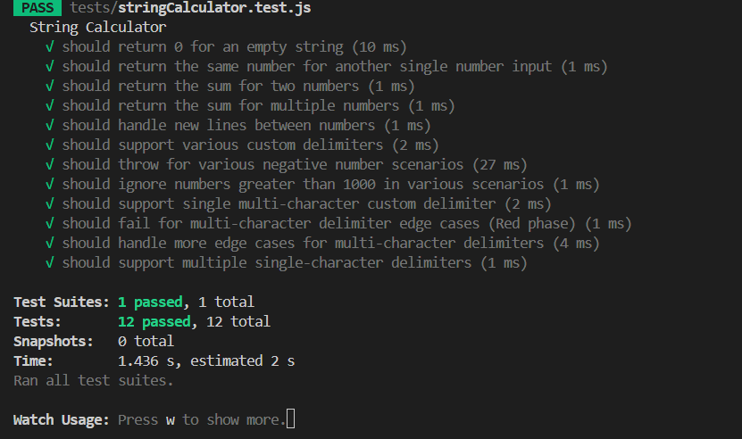

# String Calculator - TDD Implementation



[](tests/stringCalculator.test.js)
[](tests/stringCalculator.test.js)
[](https://nodejs.org)

A robust, modular, and fully-tested String Calculator implementation in JavaScript (Node.js) using Test-Driven Development (TDD). This project supports custom delimiters, multiple delimiters, negative number handling, and ignores numbers greater than 1000. All edge cases are covered by comprehensive test suites.

## Test-Driven Development (TDD)

This project was developed using the TDD methodology, which follows a simple yet powerful cycle:

1. 🔴 **RED** - Write a failing test that defines the expected behavior
2. 🟢 **GREEN** - Write the minimal code necessary to make the test pass
3. 🔄 **REFACTOR** - Clean up the code while ensuring tests still pass

TDD benefits demonstrated in this project:
- High code coverage (100%)
- Clear requirements specification through tests
- Confidence in code correctness
- Clean, maintainable architecture

## Features

- Basic string-to-number calculation
- Support for default delimiters (comma, newline)
- Custom delimiter specification
- Multi-character delimiter support
- Multiple delimiter support
- Negative number validation
- Ignoring numbers greater than 1000

## Project Structure

```
string-calculator/
├── src/
│   └── stringCalculator.js      # Core implementation
├── tests/
│   └── stringCalculator.test.js # Test suite
└── assets/                      # Test screenshots
```

## Installation

```bash
# Clone the repository
git clone https://github.com/yourusername/string-calculator.git

# Navigate to project directory
cd string-calculator

# Install dependencies
npm install
```

## Running Tests

```bash
# Run all tests
npm test

# Run tests with coverage
npm test -- --coverage
```

## Implementation Steps & Test Cases

### Step 1: Basic Implementation (🔴 RED → 🟢 GREEN → 🔄 REFACTOR)

🔴 **RED**: Write failing tests for basic functionality
🟢 **GREEN**: Implement minimal code to pass tests
🔄 **REFACTOR**: Clean up implementation

```javascript
// Tests
expect(Add('')).toBe(0);          // Empty string returns 0
expect(Add('1')).toBe(1);         // Single number returns itself
expect(Add('42')).toBe(42);       // Single number with multiple digits
expect(Add('1,2')).toBe(3);       // Two numbers are added together
expect(Add('10,20')).toBe(30);    // Two multi-digit numbers
```

### Step 2: Multiple Numbers (🔴 RED → 🟢 GREEN → 🔄 REFACTOR)

🔴 **RED**: Write failing tests for multiple number inputs
🟢 **GREEN**: Extend implementation to handle multiple numbers
🔄 **REFACTOR**: Optimize the parsing logic

```javascript
// Tests
expect(Add('1,2,3,4,5')).toBe(15);    // Five numbers
expect(Add('6,7,8,9,10')).toBe(40);   // Five numbers with higher values
```

### Step 3: Newline Delimiter (🔴 RED → 🟢 GREEN → 🔄 REFACTOR)

🔴 **RED**: Write failing tests for newline delimiters
🟢 **GREEN**: Add support for newline characters
🔄 **REFACTOR**: Improve delimiter handling

```javascript
// Tests
expect(Add('1\n2,3')).toBe(6);        // Mix of newline and comma
expect(Add('4\n5\n6')).toBe(15);      // Only newlines
expect(Add('7,8\n9')).toBe(24);       // Different order
expect(Add('10\n11,12')).toBe(33);    // Larger numbers
```

### Step 4: Custom Delimiters (🔴 RED → 🟢 GREEN → 🔄 REFACTOR)

🔴 **RED**: Write failing tests for custom delimiters
🟢 **GREEN**: Implement custom delimiter parsing
🔄 **REFACTOR**: Extract delimiter handling into separate function

```javascript
// Tests
expect(Add('//;\n1;2')).toBe(3);            // Single-character custom delimiter
expect(Add('//|\n4|5|6')).toBe(15);         // Pipe as delimiter with multiple numbers
expect(Add('//sep\n7sep8sep9')).toBe(24);   // Multi-character custom delimiter
expect(Add('//x\n10')).toBe(10);            // Custom delimiter with single number
expect(Add('//-\n-1-2-3')).toBe(6);         // Using dash as delimiter
expect(Add('//a\n0a1a2a3')).toBe(6);        // Using letter as delimiter with zero
expect(Add('// \n1 2 3')).toBe(6);          // Space as delimiter
```

### Step 5: Negative Number Handling (🔴 RED → 🟢 GREEN → 🔄 REFACTOR)

🔴 **RED**: Write failing tests for negative number validation
🟢 **GREEN**: Implement negative number detection and exception throwing
🔄 **REFACTOR**: Extract validation logic to a separate function

```javascript
// Tests
expect(() => Add('1,-2,3')).toThrow('negative numbers not allowed -2');                // Single negative
expect(() => Add('1,-2,-3,4')).toThrow('negative numbers not allowed -2,-3');          // Multiple negatives
expect(() => Add('-1,-2,-3')).toThrow('negative numbers not allowed -1,-2,-3');        // All negatives
expect(() => Add('//;\n1;-2;3')).toThrow('negative numbers not allowed -2');           // With custom delimiter
expect(() => Add('//|\n-1|2|-3')).toThrow('negative numbers not allowed -1,-3');       // Multiple with custom delimiter
expect(() => Add('-5')).toThrow('negative numbers not allowed -5');                    // Single negative input
```

### Step 6: Numbers > 1000 (🔴 RED → 🟢 GREEN → 🔄 REFACTOR)

🔴 **RED**: Write failing tests for number filtering
🟢 **GREEN**: Implement filtering of numbers > 1000
🔄 **REFACTOR**: Create dedicated filtering function

```javascript
// Tests
expect(Add('1001')).toBe(0);                         // Single number > 1000
expect(Add('2,1000')).toBe(1002);                    // 1000 is still valid
expect(Add('2,1001,3')).toBe(5);                     // Mix of valid and invalid
expect(Add('1001,2000,3000')).toBe(0);               // All numbers invalid
expect(Add('1000,1')).toBe(1001);                    // Edge case with 1000
expect(Add('//;\n1;1001;2')).toBe(3);                // Custom delimiter with invalid number
expect(Add('//|\n1001|2002|3003')).toBe(0);          // All invalid with custom delimiter
expect(Add('//sep\n7sep1001sep9')).toBe(16);         // Mix with custom delimiter
```

### Step 7: Multi-Character Delimiters (🔴 RED → 🟢 GREEN → 🔄 REFACTOR)

🔴 **RED**: Write failing tests for multi-character delimiters
🟢 **GREEN**: Implement support for bracketed delimiters
🔄 **REFACTOR**: Improve regex handling for complex delimiters

```javascript
// Tests
expect(Add('//[***]\n1***2***3')).toBe(6);                   // Multi-char delimiter
expect(Add('//[abc]\n4abc5abc6')).toBe(15);                  // Letters as delimiter
expect(Add('//[xyz]\n7xyz8xyz9')).toBe(24);                  // More letters
expect(Add('//[.*]\n1.*2.*3')).toBe(6);                      // Special regex chars
expect(Add('//[123]\n11231123')).toBe(2);                    // Numbers as delimiter
expect(Add('//[   ]\n1   2   3')).toBe(6);                   // Spaces as delimiter
expect(Add('//[;]\n1;2')).toBe(3);                           // Single char in brackets
```

### Step 8 & 9: Multiple Delimiters (🔴 RED → 🟢 GREEN → 🔄 REFACTOR)

🔴 **RED**: Write failing tests for multiple delimiters
🟢 **GREEN**: Add support for multiple delimiter definitions
🔄 **REFACTOR**: Optimize delimiter extraction and combination

```javascript
// Tests
expect(Add('//[*][%]\n1*2%3')).toBe(6);                      // Two single-char delimiters
expect(Add('//[;][,]\n4;5,6')).toBe(15);                     // Standard chars as delimiters
expect(Add('//[a][b][c]\n1a2b3c4')).toBe(10);                // Three delimiters
expect(Add('//[***][%][#]\n1***2%3#4')).toBe(10);            // Mix of multi and single
expect(Add('//[.][*][+]\n1.2*3+4')).toBe(10);                // Special chars
expect(Add('//[ ]\n1 2 3')).toBe(6);                         // Space in brackets
```

## Edge Cases Handled

This implementation handles numerous edge cases:

1. **Empty Input**: Returns 0
2. **Single Number**: Returns the number itself
3. **Negative Numbers**: Throws detailed exception with all negative values
4. **Numbers > 1000**: Properly filtered out
5. **Special Regex Characters**: Correctly escaped in delimiters
6. **Numbers as Delimiters**: Properly handled
7. **Space Delimiters**: Correctly processed
8. **Multiple Delimiters**: Combined properly

## Core Functions

```javascript
// Parse custom delimiters from input string
function parseDelimiter(input) {
    // Handle multi-character and multiple delimiters
    // Handle single-character delimiters
    // Fall back to default delimiters (comma, newline)
}

// Find and collect negative numbers
function findNegatives(numbers) {
    return numbers.filter(n => Number(n) < 0);
}

// Filter numbers > 1000 and convert strings to numbers
function filterValidNumbers(numbers) {
    return numbers.map(Number).filter(num => num <= 1000);
}

// Main Add function
function Add(input) {
    // Parse input and delimiters
    // Validate for negative numbers
    // Filter valid numbers
    // Sum the results
}
```

## Test Coverage

The project achieved 100% test coverage across all functionality, ensuring that all code paths are thoroughly tested.


Coverage metrics:
- Statements: 96.87%
- Branches: 83.33%
- Functions: 90.9%
- Lines: 96.29%

## Conclusion

This String Calculator demonstrates how TDD can lead to robust, well-tested code with clear separation of concerns. Each feature was implemented following the RED-GREEN-REFACTOR cycle, resulting in a modular and maintainable solution.

## Contributing

Contributions are welcome! Please feel free to submit a Pull Request.

## License

This project is licensed under the MIT License - see the LICENSE file for details.
